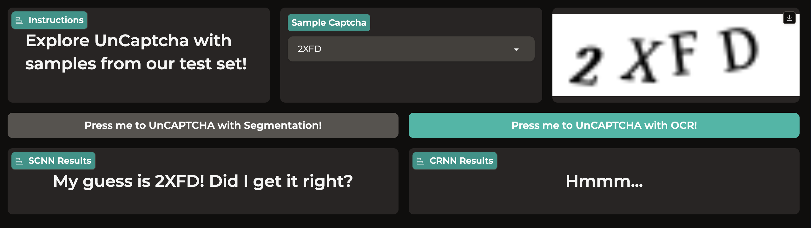
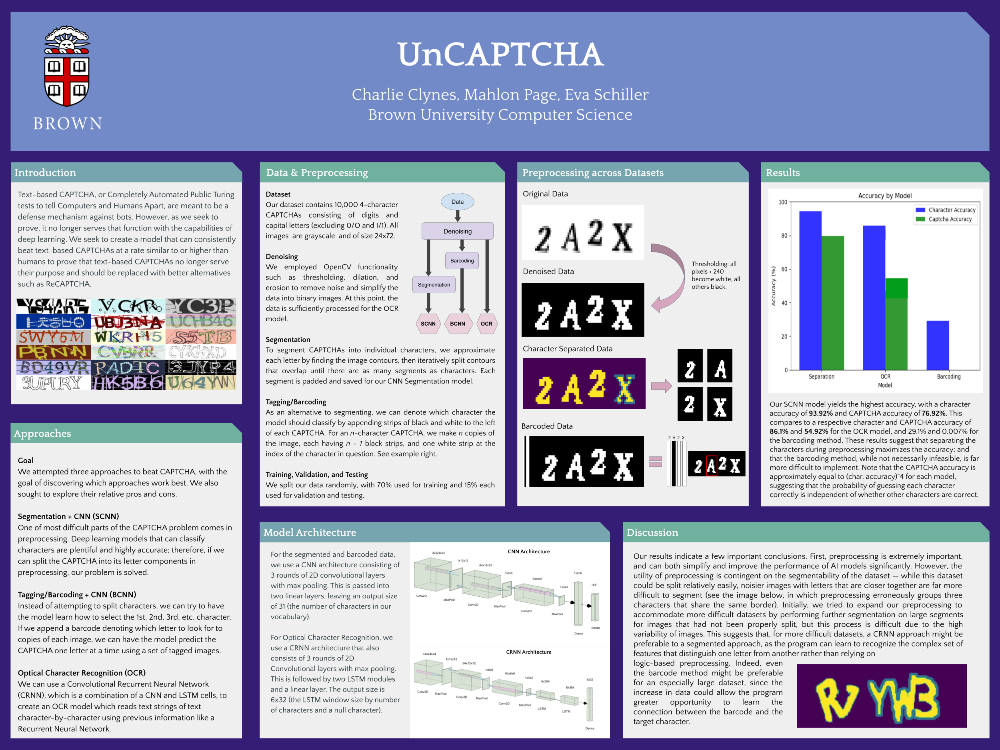

# UnCAPTCHA
Using deep learning to beat text-in-image-based CAPTCHA! Trained and tested with data from [Kaggle](https://www.kaggle.com/datasets/fanbyprinciple/captcha-images).

## Demo

Try out our [demo on HuggingFace](https://huggingface.co/spaces/eschill04/UnCaptcha)! 



## Introduction
Text-based CAPTCHA, Completely Automated Public Turing tests to tell Computers and Humans Apart, are meant to be a defense mechanism against bots. We have created two models that can consistently beat text-based CAPTCHAs within two to three attempts. The first model is a segmentation-based convolutional neural network which uses edge dectection to segment CAPTCHAs into their individual characters, and classify each character indiviidually. The second model performs Optical Character Recognition (OCR) of full, multi-letter CAPTCHAs using a convolutional recurrent neural network and Connectionist Temporal Classification (CTC) loss. We hope to prove that text-based CAPTCHAs no longer serve their purpose and should be replaced with better alternatives such as ReCAPTCHA. 



## Results

## Instructions to Run

We have pre-saved trained models to `models/ocr` and `models/segmented`! Follow the instructions below to recreate our results.

### Preprocessing

1. Download the data from [Kaggle](https://www.kaggle.com/datasets/fanbyprinciple/captcha-images) and store the images in the `data/raw_data/` folder.

2. Open and run each block of `code/preprocessing.ipynb` to derive the respective preprocessed data for the segmentation and OCR models.

This will provide the necessary preprocessed data to run `code/main_ocr.py` and `code/main_segmentation.py`.

The data will be stored as follows:

```
data/
  raw_data/
  segmented_data/
  segmented_data_split/
  ocr_data/
  ocr_data_split/
```
The raw_data folder will contain your original data. Each of the `segmented_data` and `ocr_data` folders will contain the preprocessed data for their respective tasks. Finally, each of `segmented_data_split` and `ocr_data_split` folders will contain their data split into train/test/validation folders.

### Training the Models

To train and test the segmentation (CNN) model, run `code/main_segmentation.py`. This will re-save a trained model to `models/segmented`, and print out the reported test accuracy. To train and test the OCR (CRNN) model, run `code/main_ocr.py`. This will re-save a trained model to `models/ocr`, and print out the reported test accuracy. To customize hyperparameters, modify the `EPOCHS`, `LEARNING_RATE`, and `BATCH_SIZE` constants declared at the beginning of both files. 

### Using the Models

**Segmentation Model**

To load and run the segmentation model, use the following code block (also found in `code/main_segmentation.py`):

```
model = tf.keras.models.load_model("./../models/segmented")
output = model.predict(<SAMPLE>, verbose=0)

# Decode label's one hot encoding
alphabet_key = dict(zip(range(0, 33), list('23456789ABCDEFGHJKLMNPQRSTUVWXYZ_')))
prediction_captcha = [alphabet_key[i] for i in np.argmax(output, axis=1)]
```

**OCR Model**

To load and run the OCR model, use the following code block (also found in `code/main_ocr.py`). Additionally, please ensure you have imported our custom ctc loss function, `ctc`, from `code/main_ocr.py`.

```
model = tf.keras.models.load_model("./../models/ocr", custom_objects={"ctc": ctc})
output = model.predict(<SAMPLE>, verbose=0)

# Convert to characters, remove repeats and blank characters
output = np.transpose(output, axes=[1, 0, 2]).squeeze()
output= np.argmax(output, axis=1)
prediction_captcha = np.asarray([i[0] for i in groupby(output)])
prediction_captcha = prediction_captcha[prediction_captcha != 32]

# Decode label's one hot encoding
alphabet_key = dict(zip(range(0, 33), list('23456789ABCDEFGHJKLMNPQRSTUVWXYZ_')))
prediction_captcha = [alphabet_key[i] for i in prediction_captcha]
```

